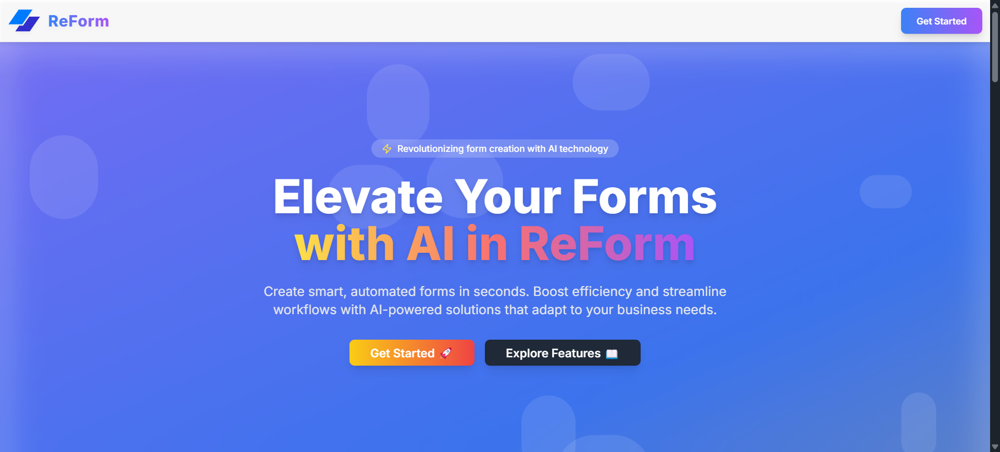

---

# **ReForm - AI Form Builder**   

**ReForm** is an AI-powered form automation platform designed to help users create, automate, and manage forms effortlessly. It provides a modern UI/UX, real-time automation, and AI-driven form-building capabilities.  

## **Features**  
**AI-Powered Form Creation** – Generate intelligent forms automatically using **Google Gemini API**.  
**Streamlined Workflow** - Manage all your forms in one intuitive dashboard.Analyze responses, and optimize your process.  
**Automated Workflows** – Simplify data collection and automation.  
**Authentication & Security** – Secure login using **Clerk authentication**.  
**Database Management** – Uses **Neon PostgreSQL with Drizzle ORM**.  
**Modern UI/UX** – Responsive and optimized for all devices.  
**Flexible Customization** – Modify AI-generated forms to match your brand. Customize fields, validation rules, and appearance with ease.  

---

## **Screenshots**  



 

---

## **Tech Stack**  
| **Technology** | **Description** |  
|--------------|----------------|  
| **React.js** | Frontend framework for UI development |  
| **Next.js** | Server-side rendering and routing |  
| **Tailwind CSS** | Styling and UI components |  
| **Clerk** | Authentication service |  
| **Neon (PostgreSQL)** | Serverless PostgreSQL database |  
| **Drizzle ORM** | Lightweight TypeScript ORM for Neon |  
| **Google Gemini API** | AI-driven form automation |  
| **Vercel** | Deployment and hosting |  

---

## **Project Structure**  
```
/app
│── _components   # Reusable UI components
│── _data         # Data storage and management
│── (auth)        # Authentication handlers
│── aiform        # AI-powered form builder
│── dashboard     # User dashboard
│── edit-form     # Form editing interface
│── layout.js     # Main layout component
│── page.js       # Landing page
│
/components       # Shared UI components
/configs         # Configuration files
/hooks           # Custom React hooks
/lib             # Utility functions
/public          # Static assets
/styles         # Global styles
```

---

## **Getting Started**  
Follow these steps to set up **ReForm** on your local machine:  

### **1️⃣ Clone the Repository**  
```sh
git clone https://github.com/your-username/ReForm.git
cd ReForm
```

### **2️⃣ Install Dependencies**  
```
npm install
```

### **3️⃣ Set Up Environment Variables**  
Create a `.env.local` file in the root directory and add the following variables:  

```
NEXT_PUBLIC_CLERK_PUBLISHABLE_KEY=your_clerk_key
NEXT_PUBLIC_BACKEND_URL=your_backend_url
DATABASE_URL=your_neon_database_url
GEMINI_API_KEY=your_gemini_api_key
```

#### **How to Set Up Neon PostgreSQL & Drizzle ORM**  
1. **Create a Neon database** – [Sign up at Neon](https://neon.tech/) and create a PostgreSQL database.  
2. **Get your database connection string** – Copy the **Neon PostgreSQL URL** and set it in `.env.local` under `DATABASE_URL`.  
3. **Install Drizzle ORM**  
   ```
   npm install drizzle-orm drizzle-kit pg
   ```
4. **Run Drizzle migrations**  
   ```
   npx drizzle-kit generate
   npx drizzle-kit push
   ```

#### **How to Get Google Gemini API Key**  
1. **Go to Google AI Studio** – [Sign up here](https://ai.google.dev/) and create an API key.  
2. **Enable the Gemini API** in Google Cloud Console.  
3. **Copy your API key** and set it in `.env.local` under `GEMINI_API_KEY`.  

---

### **4️⃣ Run the Development Server**  
```
npm run dev
```
Visit `http://localhost:3000` in your browser to see the project in action.  

---

## **Contributing**  
Contributions are welcome! Follow these steps:  
1. **Fork** the repository  
2. **Create a new branch** (`feature-branch`)  
3. **Commit changes** and push to GitHub  
4. **Open a Pull Request**  

---


## **Contact**  
For any queries, feel free to reach out:  
**tmuthuvelan0201@gmail.com**  

---

